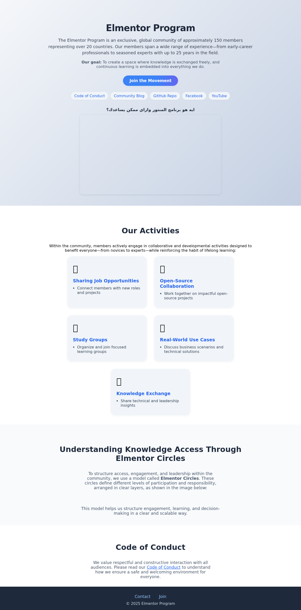
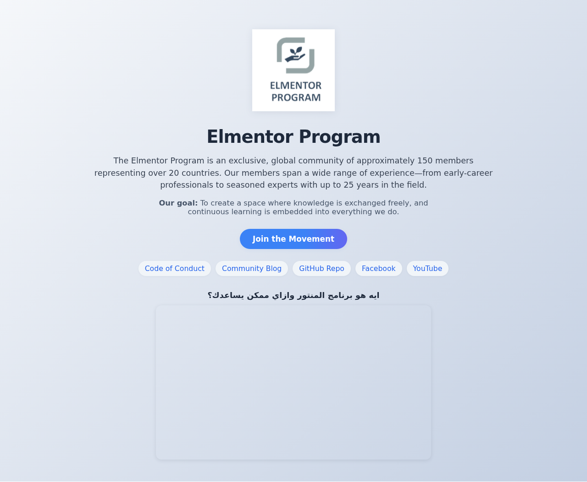

# Elmentor Program Landing Page (React + Copilot Agentic Mode)

## File Naming & Prompt Standards
- Scripts: `kebab-case` (e.g., `playwright-screenshot.js`, `playwright-video.js`)
- Components: `PascalCase` (e.g., `HeroSection.js`)
- Screenshots/videos: context and device in name (e.g., `fullpage-desktop.png`)
- Prompts: Start with a verb, include context/goal, be actionable
- Document every step: prompt, action, result

---

## Live Demo
- **URL:** https://aymanaboghonim.github.io/elmentor-landing-page-mvp/

---

## Visual Demo

### Key Screenshots





### Video Walkthrough

A full video demo is available in the `/screenshots/` folder:
- [Download/view video demo (webm)](../screenshots/a573d5f1f820bab4da172fcbd0fac03d.webm)

---

## Reproduction Steps (for Live Demo)

### 1. Project Setup
- **Prompt:**
  > “Create a new React app for a landing page MVP for the Elmentor Program.”
- In GitHub Codespaces, run:
  ```bash
  npx create-react-app .
  ```

### 2. Plan & Structure
- **Prompt:**
  > “Read the Elmentor-Program-Landing-Page-MVP-Plan.md and generate the initial React component folder structure and empty component files as specified in the plan.”
- Create `/src/components/` and add:
  - HeroSection.js
  - ActivitiesSection.js
  - CirclesSection.js
  - CodeOfConductSection.js
  - Footer.js

### 3. Scaffold Components
- **Prompt:**
  > “Scaffold each component, starting with HeroSection, using the instructions from the plan.”
- Add content and structure to each component as described in the plan.

### 4. Add Branding & Assets
- Upload `elmentor_logo.png` and `elmentor-circles-visual.png` to `/public/`.
- Reference these in HeroSection and CirclesSection.

### 5. Add Content & Links
- Use real Elmentor Program info for all sections.
- Add resource links (Code of Conduct, Blog, GitHub, Facebook, YouTube) to HeroSection.
- Embed the YouTube video in HeroSection.

### 6. Style & Polish
- **Prompt:**
  > “Add modern, responsive CSS for all sections. Ensure mobile and desktop look great.”
- Update `App.css` for:
  - Layout, spacing, and color
  - Responsive design
  - Button and link hover/focus states
  - Video embed styling

### 7. Assemble in App.js
- Import and render all sections in order.
- Remove default React boilerplate.

### 8. Deploy to GitHub Pages
- **Prompt:**
  > “Set up deployment to GitHub Pages for this React app.”
- Install gh-pages:
  ```bash
  npm install gh-pages --save-dev
  ```
- Add to `package.json`:
  ```json
  "homepage": "https://<your-username>.github.io/elmentor-landing-page-mvp",
  "predeploy": "npm run build",
  "deploy": "gh-pages -d build"
  ```
- Deploy:
  ```bash
  npm run deploy
  ```

### 9. Take Screenshots
- Use Codespaces screenshot tool or browser screenshot to capture:
  - Initial structure
  - Each section after scaffold
  - Final deployed site
- Save in `/screenshots/` (if possible).

### 10. Update Documentation
- Update `README.md` and `Elmentor-Program-Landing-Page-MVP-Plan.md` with:
  - Steps taken
  - Prompts used
  - Live URL
  - Screenshots
  - Lessons learned

---

## Automated Screenshots & Video Capture

All major sections and full-page views are captured automatically using Playwright scripts, following project file naming standards:

- **Screenshots:**
  - `screenshots/fullpage-desktop.png`
  - `screenshots/fullpage-mobile.png`
  - `screenshots/hero-section.png`
  - `screenshots/activities-section.png`
  - `screenshots/circles-section.png`
  - `screenshots/code-of-conduct-section.png`
  - `screenshots/footer.png`
- **Video Demo:**
  - `screenshots/a573d5f1f820bab4da172fcbd0fac03d.webm` (auto-generated, may have a unique hash)

Scripts used:
- `playwright-screenshot.js` — captures all screenshots above
- `playwright-video.js` — records a full-page video demo

To reproduce:
```bash
node playwright-screenshot.js   # Generates all PNG screenshots
node playwright-video.js        # Generates a .webm video demo
```

All outputs are saved in the `/screenshots/` directory for easy review and sharing.

---

## Copilot Prompts Used
- “Create a React HeroSection component introducing the Elmentor Program…”
- “List activities as cards with icons…”
- “Show Elmentor Circles visual as an image with caption…”
- “Add Code of Conduct summary…”
- “Embed a YouTube video in the HeroSection…”
- “Set up deployment to GitHub Pages…”

---

## Credits
Built with GitHub Copilot Agentic Mode in Codespaces.

---

## For Live Demo
- Open Codespaces, follow the above steps and prompts.
- Narrate each step, showing Copilot’s responses and edits.
- Deploy and share the live URL.
- Show screenshots and documentation updates.

---

## See Also
- [Elmentor Program GitHub](https://github.com/ElmentorProgram)
- [Community Blog](https://devopsvisions.github.io/)
- [Code of Conduct](https://github.com/ElmentorProgram/.github/blob/main/CODE_OF_CONDUCT.md)

## Empower Through Mentorship

We believe in empowering our community through mentorship. If you have questions, want to get involved, or just want to say hello:

### Contact Us

**Drop us a line!**

- **Name**
- **Email*** (Please enter a valid email address)
- **Message**

Sign up for our email list for updates, promotions, and more.

**Send**

---

*Note: We always keep our documentation and live app in sync. All changes are reflected in both the repository and the deployed GitHub Pages site. This is a core part of our workflow and is included in the main project plan.*

---

## Workflow Note: Reliable Deployment & Sync

**Effective Deployment Practice:**
- Always use the absolute path to the React app directory when running deployment commands in Codespaces or CI. For this project, the correct command is:

```bash
cd /workspaces/elmentor-landing-page-mvp/elmentor-landing-page && npm install && npm run deploy
```
- This ensures the deployment runs from the correct directory, avoiding common path errors.
- After every documentation or code update, always:
  1. Commit and push changes to the repository.
  2. Deploy the app to GitHub Pages to keep the live site in sync.

**Summary:**
- Document every step and workflow improvement.
- Always push and redeploy after changes.
- Keep the repo and live app in sync for a professional, reproducible demo.

---
